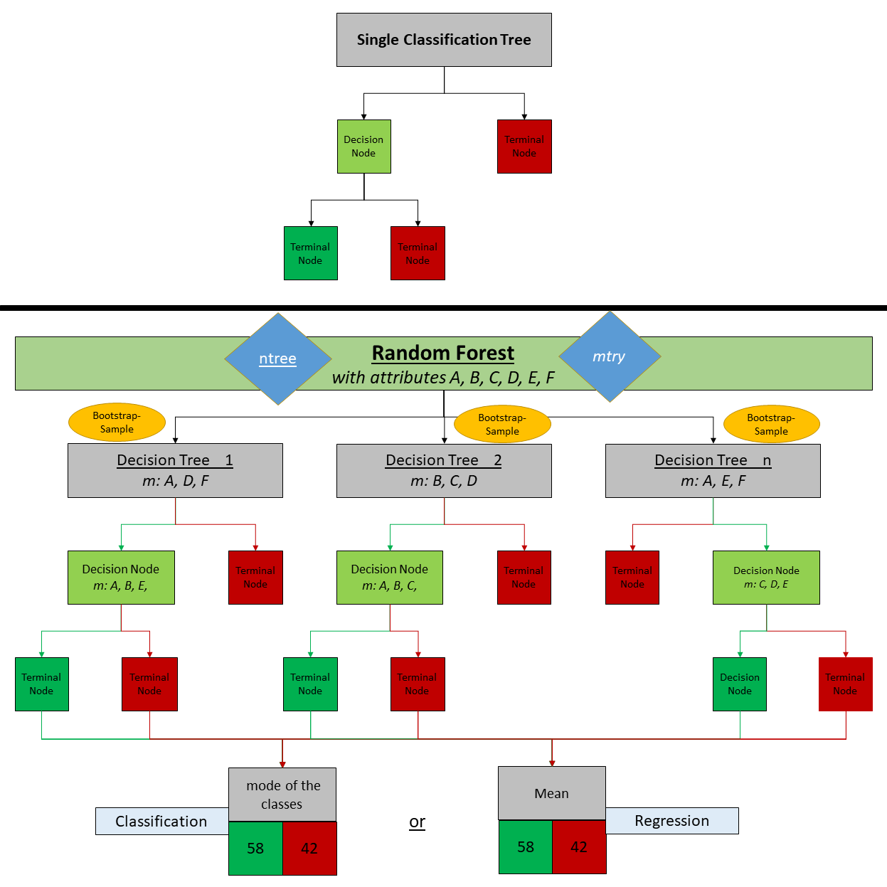
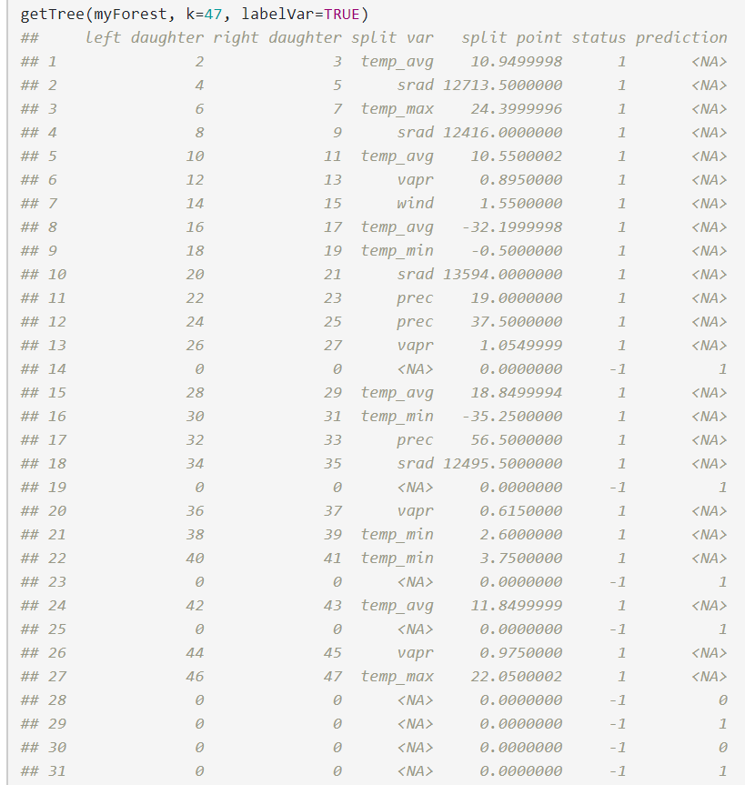
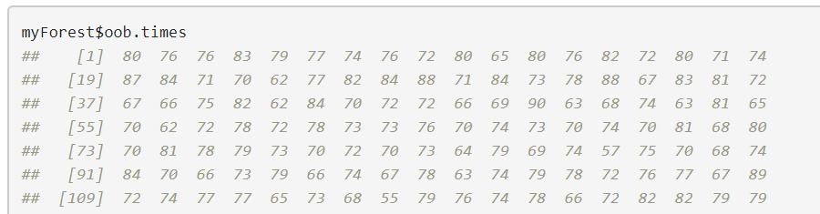
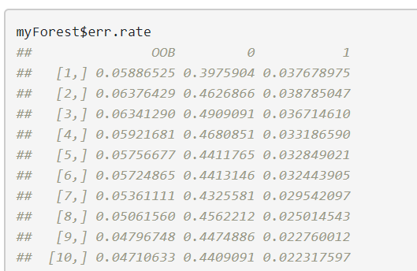

```{r setup, include=FALSE}
knitr::opts_chunk$set(echo = TRUE)
```
 
***
<br> 

# Theory of a Random Forest

<br>
The **Random Forest** (or *Random Decision Forest*) is a model in the area of machine learning. It is an extension of Classification and Regression Trees (CART). A Random Forest grows many classification trees and puts the input data down each of the trees in the forest. Each tree gives a classification, and we say the tree "votes" for that class. The forest chooses the classification having the most votes over all the trees in the forest.

  
<br>
  
***
  
<br>

## What is a Classification Tree?  

<br>

<div class="alert alert-dismissible alert-danger">
  <button type="button" class="close" data-dismiss="alert">&times;</button>
  <h4 class="alert-heading">Warning!</h4>
  <p class="mb-0">It is assumed that the user knows about the concept of single classification trees. If not, this should be studied independently beforehand. Further Information can be found on [Wikipedia](https://en.wikipedia.org/wiki/Decision_tree_learning).</p>
</div>

 <br>

<p class="text-info">Quick Reminder:</p>

Let’s  go quickly over decision trees as they are the building blocks of the random forest model. Fortunately, they are pretty intuitive and most people have used them in their lives, knowingly or not.  

Decision trees build classification or regression models in form of a tree structure. The model breaks down a dataset into smaller and smaller subsets while at the same time incrementally developing an associated decision tree. The final result is a tree with decision (internal) nodes and leaf nodes (see image below). Furthermore, a branch that splits left is called "left daughter" and one that splits right "right daughter".

Let's consider the following example in which we use a decision tree to decide upon an activity on a particular day:

<center>

     <p><small>Img. 1: Example for a simple everyday decision tree by [nexttech](https://dev.to/nexttech/classification-and-regression-analysis-with-decision-trees-jgp).</small></p>
</center>

Applied to a real life scenario our data will not be this clean but the logic that a decision tree employs remains the same.

  
<br>
  
***
  
<br>


### The Difference between a Classification Tree and a Random Forest  

<br>  

A Random Forest, like its name implies, consists of a large number of individual decision trees that operate as an ensemble. Each individual tree in the Random Forest generates a class prediction (vote) and the class with the most votes becomes our model’s prediction over all the trees in the forest (see image below, hover to enlarge).

<br>

<center>
    
     <p><small>Img. 2: Comparison between Decision Trees and Random Forest.</small></p>
</center>

The image above shows an outline of a comparison between a single Decision Tree and a Random Forest Model. To predict a classification the model needs to be filled with these five attributes A, B, C, D, E, F. Then some data is randomly picked for generating small subsets of data. Afterwards, the chosen sample is put back into the statistical population for reuse. This process is called **bootstrap-sample** and is pointed out in decision tree 1. At the first node it uses only the three attributes A, D and F. For every following node it continues to generate a new bootstrap sample of another three randomly picked attributes (A, B and E) until it ends with a terminal node. Every decision tree ends with a majority vote in which the class with the most votes wins the classification. For a regression, the mean is calculated from all votes defining the class. This process takes place for every decision tree.  

The number of trees is determined via the parameter "ntree" and the number of randomly selected attributes via "mtry" (blue squares). In this example mtry is three and ntree is n.  

These subsets of randomly picked attributes are also known as bootstrap samples. This is important to understand how the model verifies itself through the [OOB Error Rate](#oob) which makes crossvalidating unnecessary.

The function "randomForest" can take a formula or, in two separate arguments, a data frame with **predictor variables** (previously called "attributes"), and a vector with the result. If the result variable is a factor (categorical), randomForest will do a classification, otherwise it will do a regression. Whereas with species distribution modeling we are often interested in classification (species is present or not).

  
<br>
  
***
  
<br>


### Wisdom of Crowds
  
<br>


The fundamental concept behind Random Forest is a simple but powerful one: **the wisdom of crowds**. The reason why the random forest model works so well is:  

* A large number of relatively uncorrelated models (trees) operating as a committee will outperform any of the individual constituent models.  

* The low correlation between models is the key.

Uncorrelated models can produce ensemble predictions that are more accurate than any of the individual predictions. The reason for this effect is that the trees protect each other from their individual errors (as long as they don’t all constantly err in the same direction).

**That means while some trees may be wrong, many other trees will be right, so as a group the trees are able to move in the correct direction.**

The model uses **bagging** and **feature randomness** *(picking features randomly and putting them back)* when building each individual tree to try to create an uncorrelated forest of trees whose prediction by committee is more accurate than that of any individual tree.

<p class="text-info">So, what do we need in order for our random forest to make accurate class predictions?</p>

1.	We need features that have at least some predictive power (predictors).  
2.	The trees of the forest and more importantly their predictions need to be **uncorrelated** or at least have low correlations with each other.

As said, Random Forest is able to generate classification and regression models. In the upcoming exercise only the classification method is used — we want to know what class an observation belongs to (presence or absence). The ability to precisely classify observations is extremely valuable for scientists. For example predicting whether a particular organism like an animal or a plant may be present or absent in an specific area. With this information certain initiatives e.g. species and environmental protection can be assured.  

  
<br>
  
***
  
<br>


# RUN FOREST, RUN!
  
<br>


  
<br>


Now it is time to build our forest. This needs to be done in five steps:  
1. Loading the required packages  
2. Loading Environmental Data  
3. Data Preparation  
4. Generating the Forest  
5. Prediction  

For further information regarding this method in general see [Random Forests by Leo Breiman and Adele Cutler](https://www.stat.berkeley.edu/~breiman/RandomForests/) and especially [CRAN R Package Information for randomForest](https://cran.r-project.org/web/packages/randomForest/randomForest.pdf). 

Title: Breiman and Cutler's Random Forests for Classification and Regression  
Package: ‘randomForest’  
Version: 4.6-14  

  
<br>
  
***
  
<br>


## Loading required packages
  
<br>


We will need to install/activate three packages: **maptools**, **dismo** and **randomForest**. But a total of five packages is installed. The remaining two packages "sp" and "raster" are already activated through maptools and dismo. 

```{r library1, collapse=TRUE}
library(maptools) #includes the library of sp
```

```{r library2, collapse=TRUE}
library(dismo) #includes the library of raster
```

```{r library3, collapse=TRUE}
library(randomForest)
```

  
<br>
  
***
  
<br>


## Loading environmental data

<br>

First we load the predictor files into R. They are used to predict a feature variable. More information regarding the predictor files can be found at section [Info Dataset](#inda).

```{r load_predictor_files, collapse=TRUE}
setwd('C:/Users/Mandy/Documents/Uni/PROJECT_PAKISTAN/R/')
p_files <- list.files(path='C:/Users/Mandy/Documents/Uni/PROJECT_PAKISTAN/R/wc2.0_30s_predictor_files/', full.names=TRUE )
```
  
<br>


We then stack the single predictor files to a raster stack.

```{r stack_predictor_files, collapse=TRUE}
predictors <- stack(p_files) #Raster-stacking 9 predictor files to one file
#predictors # show Raster-Stack information is optional
#names(predictors) # show names of predictors is optional
```
  
<br>


This is what the raster stack now looks like.

```{r plot_predictor_stack, collapse=TRUE}
plot(predictors)
```
  
<br>

Now we load the the borders of Pakistan to make it visually more attractive and load the presence points of our butterfly data. This data is taken from Tshikolovets & Pagès (2016): The Butterflies of Pakistan.

```{r data, collapse=TRUE}
#library(maptools)
data(wrld_simpl) # load outline of world

# loading Data of butterflies
file <- paste(path='C:/Users/Mandy/Documents/Uni/PROJECT_PAKISTAN/R/distribution_merged_Pakistan/distribution_butterflies_pakistan.csv')
butterflies <- read.table(file, header=TRUE, sep=',')
```
  
<br>


Afterwards we plot the spatial data points also into the map.

```{r data_plot, collapse=TRUE}
# Plotting, first layer of the RasterStack prec
plot(predictors, 1) #plot prec
plot(wrld_simpl, add=TRUE) #plot worldmap on top of Bio1, note the "add=TRUE" argument with plot
points(butterflies, pch=19, cex=0.1, col='black') #add point on top of predictors and worldmap
```

  
<br>
  
***
  
<br>


## Data Preparation
  
<br>


We now have a set of predictor variables (rasters) and presence points.  
The next step involves extracting every value of every predictor file at the locations of the butterfly presence points.

Why do we do this? To know which climatic conditions the butterflies like and don't like. With this information we generate a training and a testing set for the Random Forest model.  

In particular this means we  

1. delete all unnecessary columns from the original database of presence points (species, subspecies and id). We only need the coordinates.  

2. extract all values of presence points from the predictor stack.  

3. generate randomly 500 absence points from background data (what background data is can be read on [rspatial.org](https://rspatial.org/raster/sdm/3_sdm_absence-background.html))  

4. combine presence and absence points into a single data frame in which the first column (variable 'pb') indicates whether this is a presence (1) or a background/absence (0) point.  

5. declare **pb as factor**; pb is a categorical variable (called a 'factor' in R ) and this explicit definition is important so it won't be treated like any other numerical variable. Our goal is still a classification whether a spot is suitable for a butterfly or not. If we wouldn't declare a factor, Random Forest would do a regression instead of classification.  

6. split the original dataset into a training and a testing set. With these sets we train and test the model.  

```{r data_prepation, collapse=TRUE}
#1 deleting unnecessary rows
butterflies <- butterflies[,-(3:5)] #-(3:5) = delete Position 3 to 5

#2 presence-points
presence <- extract(predictors, butterflies) # Extracting presence values from rasters

#3 setting random seed to always create the same random set of points for this example
set.seed(0)
background <- randomPoints(predictors, 400) # creating 400 random absence-points
absence <- extract(predictors, background) # Extracting absence values from rasters

#4 combining presence and absence with value 1 (present) and value 0 (absent)
pb <- c(rep(1, nrow(presence)), rep(0, nrow(absence))) 
sdmdata <- data.frame(cbind(pb, rbind(presence, absence))) # putting pb and climate data into a single dataframe 

#5 pb as factor
sdmdata[,'pb'] = as.factor(sdmdata[,'pb']) # set column 'pb' as factor, otherwise it'll do Regression

#6 splitting data in training and testing sets
set.seed(123) # set seed so that same sample can be reproduced in future 
sample <- sample.int(n = nrow(sdmdata), size = floor(.60*nrow(sdmdata)), replace = F) # selecting 60% of data as sample
train <- sdmdata[sample, ] # filling train set with 60% of original data
test  <- sdmdata[-sample, ] # filling test set with 40% of original data
```


```{r summary, collapse=TRUE}
summary(sdmdata)
```

  
<br>
  
***
  
<br>


## Generating Random Forest
  
<br>


First we take a look at the structure of this method and check out some important arguments: 

**randomForest(argument1, argument2, argumentx)** is the name of the method and implements Breiman’s random forest algorithm based on Breiman and Cutler’s original Fortran code.

*A list of all possible arguments can be found in this dokumentation from [CRAN R Project](https://cran.r-project.org/web/packages/randomForest/randomForest.pdf).*  

<table class="table table-hover">
  <thead>
    <tr>
      <th scope="col">argument</th>
      <th scope="col">result</th>
      <th scope="col">example</th>
    </tr>
  </thead>
  <tbody>
    <tr class="table-light">
      <th scope="row">var_result ~</th>
      <td>Variable var_result is required and should contain the factor presence or absence (1 or 0); the tilde with fullstop means that the prediction will be run with all remaining predictor files except itself; otherwise specific attributes must be named individually</td>
      <td>pb ~. </td>
    </tr>
        <tr class="Default">
      <th scope="row">data</th>
      <td>An optional data frame containing the variables in the model. By default the variables are taken from the environment which randomForest is called from; dataset for bootstrap-sample</td>
      <td>data=datasetTrain, </td>
    </tr>
    <tr class="table-light">
      <th scope="row">importance</th>
      <td>Should importance of predictors be assessed? Activates the variable importance computation.</td>
      <td>importance=TRUE, <br> importance=FALSE, </td>
    </tr>
        <tr class="Default">
      <th scope="row">mtry</th>
      <td>Number of variables randomly sampled as candidates at each split. Note that
the default values are different for classification (sqrt(p) where p is number of
variables in x) and regression (p/3)</td>
      <td>mty=3, <br> mty=5, </td>
    </tr>
        <tr class="table-light">
      <th scope="row">ntree</th>
      <td>Number of trees to grow. This number should not be too small to ensure that every input row gets predicted at least a few times. The more trees are chosen, the longer it will take to compute.</td>
      <td>ntree=100, <br> ntree=1000, </td>
    </tr>
        <tr class="Default">
      <th scope="row">replace</th>
      <td>Should sampling of cases be done with or without replacement?</td>
      <td>replace=TRUE, <br> replace=FALSE, </td>
    </tr>
        <tr class="table-light">
      <th scope="row">do.trace</th>
      <td>If set to TRUE, it gives a more verbose output as randomForest is run. If set to some integer, then running output is printed for every do.trace tree.</td>
      <td>do.trace=TRUE, <br> do.trace=FALSE, </td>
    </tr>
        <tr class="Default">
      <th scope="row">keep.forest</th>
      <td>If set to FALSE, the forest will not be retained in the output object. If we want to take a deeper look into the structure of a single tree.</td>
      <td>keep.forest=TRUE, <br> keep.forest=FALSE, </td>
    </tr>
    <tr class="table-light">
      <th scope="row">na.action</th>
      <td>randomForest package has functions that "imputes Missing Values" e.g. "na.roughfix" imputes by median/mode.</td>
      <td>na.action=na.roughfix,</td>
    </tr>
  </tbody>
</table>

  
<br>
  
***
  
<br>


Finally we implement the Forest:

```{r myForest, results='hide'}
#library(randomForest)
set.seed(123) 
myForest<- randomForest(pb ~., data=train, importance=TRUE, mtry=3, ntree=200, replace=TRUE, do.trace=TRUE, keep.forest=TRUE, na.action=na.roughfix)
```

```{r myForest2}
myForest
```

**set.seed(123)**: A seed is used to initialize a pseudorandom number generator. If the same seed is deliberately shared, it becomes a key, so two or more systems using matching seeds can generate the same pseudorandom numbers in their own models to reproduce and match the results.  

**myForest <-** is the name of the variable in which the forest is stored.  
  

If we want to take a deeper look into one single tree we can use the function **getTree**. This function extracts the structure of a tree from a randomForest object represented as matrix. *myForest* is a randomForest object, *k* is a specific tree to extract and *labelVar=TRUE* means label names are used for splitting variables and predicted classes instead of meaningless numbers.  


```{r myforest_getTree, results='hide'}
getTree(myForest, k=47, labelVar=TRUE)
```

<center>
    
     <p><small>Img. 3: Screenshot of the function getTree().</small></p>
</center>

What does this mean?

In column 1 row 1 the root of tree k asks, if **split var** is smaller than **split point**. Split var refers to the predictor files and split point to its values. The status delivers the answer in a Boolean expression of true (1) or false (-1).  

* Status 1 forwards to a numbered node (column 1) shown in the left and right daughter expanding the tree. Each node queries a different split variable. The prediction column remains <NA> as long as the answer is TRUE.  

* Status -1 terminates the node resulting in a prediction 1 or 0. The value is taken from the factor pb. This means a butterfly is present or absent.  

  
<br>
  
***
  
<br>


### OOB-Error Rate {#oob}
  
<br>

The out-of-bag (OOB) score is a way of validating the Random Forest model. The original training data is randomly sampled-with-replacement generating small subsets of data. These subsets are also known as bootstrap samples. These samples are then fed as training data. Each of these decision trees is trained separately on these. The concluding result is determined by counting a majority vote from all the decision trees. 

The sample that is “left out” in the original data is known as Out-of-Bag sample. This will not be used as training data. After the decision tree model has been trained, this leftover sample (or the OOB) will be given as unseen data to the decision trees. Then the tree will predict the outcome. It compares the OOB outcome with the real outcome in the dataset. If the outcomes are identical, a correct prediction was made. If they are not identical, a false prediction was made.

Long story short: The OOB score is computed as the number of correctly predicted outcomes from the out-of-bag sample.

Therefore the OOB error rate is a good estimate for the generalization error.

Below shows a confusion matrix with the OOB data.
This means for generating the decision trees bootstrap sample y was NOT USED xx times. We can also calculate the mean OOB for all samples.

```{r oob_1, results='hide'}
myForest$oob.times
mean(myForest$oob.times)
```

<center>
    
     <p><small>Img. 4: Screenshot of a Matrix showing the times a sample was not used (OOB).</small></p>
</center>

  
<br>
  
***
  
<br>


Display of OOB error rate in a matrix. In the last row we can find the final OOB. This is the percentage for wrong or right prediction of presence | absence points.
```{r oob_2, results='hide'}
myForest$err.rate
```

<center>
    
     <p><small>Img. 5: Screenshot of the OOB Error Rate.</small></p>
</center>

  
<br>
  
***
  
<br>


This plot shows the evolution of the OOB over an increasing number of trees. Why is it important? Because you should ask yourself: "How many trees should I create within a forest?" Answer: There are large fluctuations with a low number of trees and leveling out with a higher number. On x axis the trees are shown, on y axis is the OOB error displayed. 

```{r oob_plot, }
plot(myForest$err.rate[,1], type="l")
```  

  
<br>
  
***
  
<br>


## Prediction

<br>

With the information of presence points the first prediction verifies our model. 

1. Feed the Forest with training data and calculate the reinstatement error.
```{r prediction_train_1}
class_train <- train$pb
```
  
<br>


The command 'predict' initiates the prediction. The previously generated forest (myForest) is used with the dataset 'train' again to verify the generated results. There should be a high matching quote and have the smallest possible reinstatement errors on the sample.

With the information of presence points the first prediction verifies our model. 
The command 'predict' initiates the prediction. The previously generated forest (myForest) is used with the dataset 'train' again to verify the generated results. There should be a high matching quote and the smallest possible reinstatement errors on the sample.

```{r prediction_train_2}
prediction_train <- predict(myForest, newdata=train) 

table_train <- table(class_train, prediction_train) # saving matrix in a table
table_train # perfect results?
```
  
<br>


2. Feed the Forest with test data and calculate the generalization error.

```{r prediction_test}
class_test <- test$pb

prediction_test <- predict(myForest, newdata=test)

table_test <- table(class_test, prediction_test)
table_test # perfect results?
```

  
<br>
  
***
  
<br>


### Plot the Prediction
  
<br>

And finally we are visualizing the prediction
```{r plot_result}
r = raster(predictors, 1)
par(mfrow=c(1,2))
plot(!is.na(r), col=c('white', '#F6E3CE'),legend=FALSE, main='Presence of Butterlies')
plot(wrld_simpl, add=TRUE, border='dark grey')
points(butterflies, pch=19, cex=0.1, col='black')
prediction <- predict(predictors, myForest)

plot(prediction, col=c('#F6E3CE', 'black'), legend=FALSE, main='Possible Habitats for Butterflies')
plot(wrld_simpl, add=TRUE, border='dark grey')
```

  
<br>
  
***
  
<br>


### Variable Importance Plot
  
<br>

The variable importance plot shows the importance for every variable in two methods: Mean Decrease Accuracy and Mean Decrease Gini. More information regarding these two see [Louppe et. al (2013):](https://papers.nips.cc/paper/4928-understanding-variable-importances-in-forests-of-randomized-trees.pdf). The importance increases from bottom to top.

```{r varImpPlot}
imp <- varImpPlot(myForest)
imp
```

We can also display how often which variable was used
```{r varUsed}
varUsed(myForest, by.tree=FALSE, count=TRUE)
head(sdmdata) #show variables names again
```

  
<br>
  
***
  
<br>

# Info Dataset {#inda}
  
<br>


*Why did we choose those variables?*
  
<br>


Img. 6: Butterfly at Malakand, Pakistan.
     

**Solar Radiation (srad):** The bodies of butterflies have to be warm (about 25 to 26 °C) to fly. Because they cannot regulate their body temperature themselves, they depend on their environment, more specifically the sunlight. To get the maximum exposure to warmth they bask in the sun with spreaded wings. But in hotter climates they can also easily overheat so they are usually only active in the early morning, late afternoon or early evening (aka the cooler parts of the day). They rest in the shade during the heat of the day. Butterflies living in cooler climates and moths may warm their bodies by vibrating their wings, and heat insulating hair.

**Precipitation/Water Vapor (prec/vapr):** As the [Scientific American](https://www.scientificamerican.com/article/what-do-butterflies-do-wh/) stated, butterflies are rarely seen during heavy rains and wind. Not only is rain a direct threat of injury or death, but the cool air associated with storms may also reduce temperatures below the thermal threshold for flying. Overcast skies limit their ability to gather the solar radiation needed to fly. When skies darken, butterflies seek shelter in their nighttime homes. Furthermore, a butterfly knocked out of the air by raindrops faces the double threat of crashing in an inhospitable habitat where predators lay in wait, and being unable to warm its body sufficiently to regain flight. 

**Wind speed:** As [Professor Robert Dudley](https://www.mentalfloss.com/article/56464/how-can-butterfly-weighing-no-more-feather-fly-wind), head of the Animal Flight Laboratory at U.C. Berkeley states, no matter the animal, if wind speed exceeds maximum flight speed, then it can't fly. Different species of butterflies fly at different speeds, and the range is about 1.5 to 10 meters per second. If the windspeed is any higher than that, then the butterfly isn't slipping the surly bounds of Earth to cut through it. He also says that many small butterflies avoid high winds as they would merely drift. A butterfly's wing is more suceptible to ambient winds, so, while capable of flying into the wind, they aren't exactly engineered for it. Nevertheless, windy days can also be useful. With help of tailwinds, migrating butterflies can travel at 100km/h at an altitude of several hundred metres.

**Temperature (min/max/avg):** As stated butterflies need warm temperatures to maintain their body warmth. It also affects the metamorphosis. Larva and pupae exposed to warmer temperatures develope into butterflies about twice as fast as those exposed to cooler temperatures. Therefore the temperature is an important variable.

<br>

We took the predictor files from [WorldClim](http://worldclim.org/version2). It has average monthly climate data for minimum, mean, and maximum temperature and for precipitation for the years of 1970 to 2000. Variables can downloaded for different spatial resolutions, from 30 seconds (~1 km²) to 10 minutes (~340 km²). Each download is a "zip" file containing 12 GeoTiff (.tif) files, one for each month of the year (January is 1; December is 12).  

Below the units of each predictor is shown: 

<table class="table table-hover">
  <thead>
    <tr>
      <th scope="col">Name of predictor file</th>
      <th scope="col">Description</th>
    </tr>
  </thead>
  <tbody>
    <tr class="table-light">
      <th scope="row">temp_min</th>
      <td>minimum temperature in °C</td>
    </tr>
        <tr class="Default">
      <th scope="row">temp_max</th>
      <td>maximum temperature in °C</td>
    </tr>
    <tr class="table-light">
      <th scope="row">temp_avg</th>
      <td>average temperature in °C</td>
    </tr>
        <tr class="Default">
      <th scope="row">prec</th>
      <td>precipitation in mm</td>
    </tr>
        <tr class="table-light">
      <th scope="row">srad</th>
      <td>solar radiation in kJ m^-2^ day^-1^</td>
    </tr>
        <tr class="Default">
      <th scope="row">vapr</th>
      <td>water vapor pressure in kPa</td>
    </tr>
        <tr class="table-light">
      <th scope="row">wind</th>
      <td>wind speed in m s^-1^</td>
    </tr>
  </tbody>
</table>

  
<br>
  
***
  
<br>


# Sources
  
<br>


* [Random Forests by Leo Breiman and Adele Cutler](https://www.stat.berkeley.edu/~breiman/RandomForests/)  
* [CRAN R Package Information for randomForest](https://cran.r-project.org/web/packages/randomForest/randomForest.pdf)

* [Fick, S.E. and R.J. Hijmans, 2017. Worldclim 2: New 1-km spatial resolution climate surfaces for global land areas. International Journal of Climatology](http://worldclim.org/version2)

* [Olson, D. M., Dinerstein, E., Wikramanayake, E. D., Burgess, N. D., Powell, G. V. N., Underwood, E. C., D'Amico, J. A., Itoua, I., Strand, H. E., Morrison, J. C., Loucks, C. J., Allnutt, T. F., Ricketts, T. H., Kura, Y., Lamoreux, J. F., Wettengel, W. W., Hedao, P., Kassem, K. R. 2001. Terrestrial ecoregions of the world: a new map of life on Earth. Bioscience 51(11):933-938.](https://www.worldwildlife.org/publications/terrestrial-ecoregions-of-the-world) 

* Tshikolovets, V.V. & J. Pagès (2016): The butterflies of Pakistan. Pardubice.

* [Louppe, Gilles & Wehenkel, Louis & Sutera, Antonio & Geurts, Pierre. (2013). Understanding variable importances in Forests of randomized trees. Advances in Neural Information Processing Systems. 26.](https://papers.nips.cc/paper/4928-understanding-variable-importances-in-forests-of-randomized-trees) 

* What do butterflies do when it rains? by [Scientific American](https://www.scientificamerican.com/article/what-do-butterflies-do-wh/)

* [How Can a Butterfly, Weighing No More Than a Feather, Fly Into the Wind?](https://www.mentalfloss.com/article/56464/how-can-butterfly-weighing-no-more-feather-fly-wind) 


**Image sources**

* "Example for a simple everyday decision tree" by [nexttech](https://dev.to/nexttech/classification-and-regression-analysis-with-decision-trees-jgp)

* "Run Forrest, Run!" via [giphy](https://giphy.com/)

* "Butterfly at Malakand, Pakistan" by [Kasim Patel](https://commons.wikimedia.org/wiki/File:Butterfly_at_Malakand,_Pakistan.jpg)

  
<br>
  
***
  
<br>


# Further Information
  
<br>


* [Simplilearn: Random Forest Algorithm](https://www.simplilearn.com/random-forest-algorithm-article)  

* [Tony Yiu: Understandig Random Forest: How the Algorthm works and why it is so effective](https://towardsdatascience.com/understanding-random-forest-58381e0602d2)  
  
For a quick summary watch this video by [Gopal Prasad Malakar](https://www.youtube.com/channel/UCASIK966SA2NyLh5Ls6-21A):  
<br> <br> 
<iframe width="560" height="315" src="https://www.youtube-nocookie.com/embed/LIPtRVDmj1M" frameborder="50" allow="accelerometer; autoplay; encrypted-media; gyroscope; picture-in-picture" allowfullscreen></iframe>

  
<br>
  
***
  
<br>


# Session info
  
<br>

Print version of information about R, the OS and attached or loaded packages which was used. It is only for information purposes and will increase reproducibility.
```{r session_info}
sessionInfo()
```

