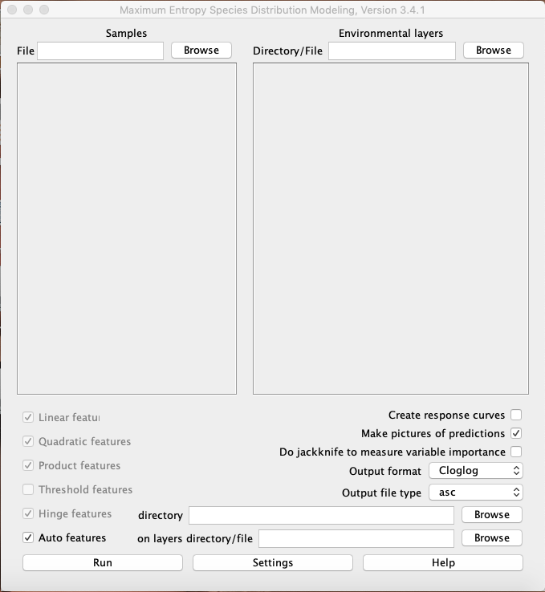
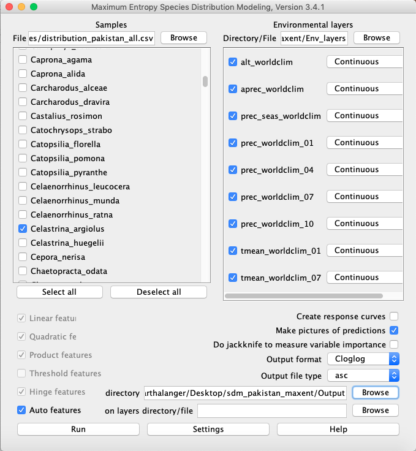
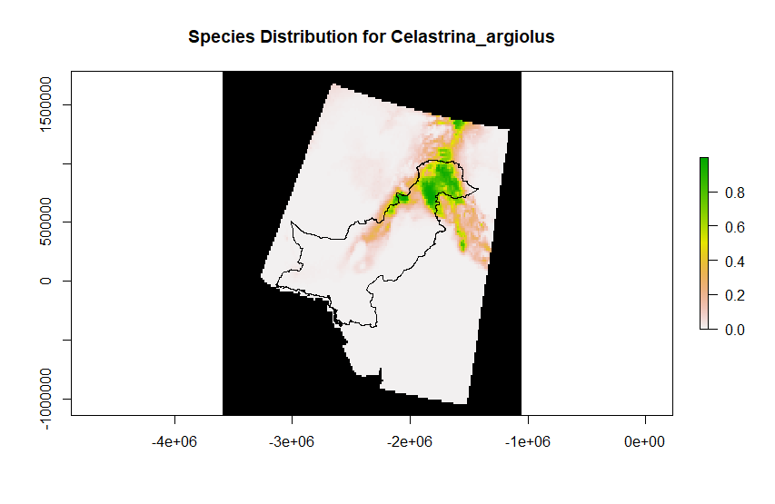

# 1. Introduction

This tutorial on how to use maxent is based on the Maxent-Tutorial by Steven J. Phillips, published on the biodiversityinformatics webpage of the american museum of natural history. Link in the references.


# 2. Preperation

To get maxent running you need to have [java runtime env. 1.4 or higher](https://www.java.com/de/download/) installed on your computer.
If you havent already installed it by now, this is the time to do it.

You can [download maxent](http://biodiversityinformatics.amnh.org/open_source/maxent/) for free as its provided as an open source programm.
You'll need maxent for proceeding in this tutorial, so go on and download it. 

Furthermore download [this data](https://hessenbox.uni-marburg.de/download/MkhFaFFLbnJiZ3Zid0RzQTVZWDFh/playground/Kluga_data/sdm_pakistan_maxent). It provides you with samples and environmental layers, which you need each to process species distributions in maxent.

#### Hind:

Put the downloaded data as well as the maxent into a single folder, so you have a quick overwiev. Maxent can generate a lot of data, so with a good structure you dont lose orientation. 


# 3. Getting into MaxEnt

If you are running on Windows, start the maxent.bat, otherwise cklick the maxent.jar file. You'll see a picture like this:

<!-- -->


### Step one - Get running

For now, you'll find three important fields to be filled. First of all, the samples-file. Secondly the environmental layers, that you need to define as continous or categorial. The provided data is all continous. And at last the outputdirecory. You can find each of the files in the provided data. 

We'll use only one species for this tutorial, because we will do several runs and due to the memory its easier that way. Because there are many samples we have of this kind, we'll work with

#### Celastrina argiolus

<!-- -->

(Picture: Gröschl, H.(2003). Reference: "https://www.naturspektrum.de/ns1.htm", last acces: 11.02.2020)


#### Go on as followed: 

- link "distribution_pakistan_all.csv" in the samples-folder to the samples. Due to tutorial uses deselect all samples, find Celastrina_argiolus and tick it. 

- link the "Env_layers" folder to the Environmental layers. 

- link the "Output" folder to the directory

It should look like this

<!-- -->

Try and let it run.

.

.

.

If one did everything right, in the outputfile, you can find a .html file. Open it up and go trought it. Take a look at the variable contributions. Here you can see how important each variable for modelling this species' distribution is. 


### Step two - simple statistics

In the next step, please go to settings in Maxent. For tutorial reasons, remove the tick at "ask before overwriting". Then go to "Random Test Percentage" and fill in "30". This will take random 30% of your trainingsamples to validate your model via crossvalidation.

It should look like this

<!-- -->


You can also find out exactly which variables matter most for the species you are looking at. Remember that if you do the test with all species, each variable matters differently for each species.

- go to maxent and tick the box "Do jacknife to measure variable importance". Then run.

You should get something close to this:

<!-- -->

You can see here, which variables are usefull for maxent to modell the distribution of Celastrina.
In our example you can see e.g. that the anual precipitation is not helping to gain the training data, but generalizes better to give better results for test data.

### Step three - Take a closer look

Now we'll take a look on how the prediction responds to our variables.

- go to maxent and tick the box "Create response curves". Untick the jackknife. Then run.

Take a look at the .html-file again. You should find responsecurves, which tell you how the single environmental layers influence Celastrina. 

They should look like this

<!-- -->

You can see, that Celastrina somehow responds to a high precipitation in January in Pakistan.


### Step four - Replication and Regularization

There are two more important things to know.
First there is the Replication. If you use a small dataset you can replicate your modell and summarize the outcome to get a better fit to your modell.  

- Go to Settings and write a "10" behind Replicates. This will do your modell ten times and gives you a summary. This is helpfull if one has only few species provided in the data. "10" is now for tutorial reasons, because it gives a representative look to what the replicates do, without lasting to long in calculation. (1o replicates means maxent calculates everything ten times, wich needs ten times longer, wich can last very long with much data). Go on and run.

The summarized .html file should look like this

<!-- -->

The blue field shows the difference between the ten modells and gives information about the variation.


You can also regularize your modell to define how closely-fitted your modell should be. 
You can find it in the basic settings.

A regularization multiplier < 1 gives you a close fitting modell to your presence data, but will get problems with new given data. 

A regularization multiplier >1 gives you a spread fit which less localizes your presence data, but will better fit to new given data.

To take the right multiplier, it depends on what kind of modell one wants to create.

### Maxent Results

In the End, you should receive a plot, which looks somehow like this

<!-- -->

As one can see in the Legend, the values of this plot are somewhere between 1 (red) and 0 (blue). So one can see that the red and redish pixel represent pixels with a high prediction, whereas blue and blueish pixels indicate a low prediction. Green and greenish pixels lay somewhere in between. 

There are also black pixels, which refer to pixels with no background data. 

White and purpil pixels show the points from the trainingdata (in white) and the testdata (in purpil).

### Results

Now we can create a map that we can work with. The usual output format of maxent is ascii. To make it more accessible, we're gonna change the format to tiff using R.

```{r, eval=F, echo=T}
library(raster)
library(rgdal)
library(ggplot2)

# Set Working Directory
wd <- "C:/Users/Alexander/PowerFolders/bsc-sdm-2019 (Funktions-Account uilehre)"
setwd <- wd

# Read in a raster grid. CRS is EPSG 102025 (albers equal area). This is the project crs.
raster_50 <- readOGR(paste0(wd, "/data/shape/Gitter/Gitter_50km.shp"))

# Get country boundaries for mapping and reproject to EPSG 102025
pakistan <- getData("GADM", country="Pakistan", level=0)
pakistan <- spTransform(pakistan, crs(raster_50)) 

# Env_Layer, just some worldclim-data to get crs used during maxent-modelling

env_layer <- getData("worldclim", var = 'tmin', res = 10)

# Now list all files in the maxent output distribution and pic the ascii-data, because thats what one is looking for
all_files_in_distribution   <- list.files(path = paste0(wd, "/GIS/output/modelling/maxent/Maxent_Output/"), recursive = T)
asc_paths                   <- grep(".asc$", all_files_in_distribution, value=TRUE)            

# get the number of species to process for the loop
number_of_species_to_process <- length(asc_paths) 

# loop to read in each ascii-data as raster, give it the crs used while modelling, reproject to project crs and finally wride out each again as a geotiff. 

asc_list <- list() 
for(i in 1:number_of_species_to_process){                                    # Only number_of_testspecies for testing
  asc_list[[i]]                 <- raster(paste0(wd, "/GIS/output/modelling/maxent/Maxent_Output/", asc_paths[i]))
  crs(asc_list[[i]])            <- crs(env_layer)                            #add crs back (lost in MaxEnt)
  asc_list[[i]]                 <- projectRaster(asc_list[[i]], crs = crs(pakistan)) #reproject to EPSG 102025
  species_name                  <- labels(asc_list[[i]])                     #get species names for saving
    writeRaster(asc_list[[i]], 
                filename = file.path(wd, "/GIS/output/modelling/maxent/Maxent_Output_Tiff/", species_name), 
                format = "GTiff", 
                overwrite = TRUE)
}

plot(asc_list[[i]], main = paste0("Species Distribution for ", species_name), colNA = "black")
plot(pakistan, add=TRUE)

```

#### This is an example for the modelled distribution of Celastrina_argiolus:

<!-- -->

In this map, white pixels will indicate a low fit for the certain species to live there. Yellow will show a well fit and where one will probably find the species. Green pixels show the spots with the best fit for this species.

You can see the pakistan boundary to know the place of interest, whereas its also interesting to have at least a look in a slightly bigger scale. A butterfly does not count on any border. 

The spots in the south western part of pakistan can be explained with the ocean. The Envirnomental Layers are from Land Surface Data, so only few pixels of the coast are included. No pure oceanic pixels. Wich makes sense, because butterflies dont live in the ocean. 

We can see now, that theres a high fit for Celastrina argiolus in the northern part of pakistan. There is also a trim "path" following the northwestern boundary, where Celastrina argiolus also results in a high fit. It seems like the central and coastal parts of pakistan dont fit for Celastrina argiolus so, believing in maxent, one probably wont find it over there.

# 4. Exploration

To gain a better understanding on maxent, try following tasks and test out maxent. 

- change the output formats, what happends in the results?
    .
    .
    .
    .

- How do feature types influence the response curves?
    .
    .
    .
    .

- How are the predictions affected if you change the regularization multiplier?
    .
    .
    .
    .

As one finds out, maxent is a very powerfull tool, which results highly depend on what one feeds to the model and how one regulizes it. The key to a resilient modell is to use high quality data and use realistic values for modelling. Its important to know how maxent works and to work with its settings, to gain a good fitting model.

# 5. Outlook

If one creates a well fitting and resilient modell it can be used to do things with it.

If one has many species to modell one can stack these and create a richness map for a region or a whole country. These can be used to define protective biological wildlife habitats or national parks. 

One can create change detections in species distributions over time. These can be used to modell e.g. the impact of climate change to these species distributions.

Or one can simply compare different species distributions for ecological studys.

All in all maxent is a powerfull tool to use for distributin modelling, which provides one with simple statistics, plots and geodata, even though it has to be treated with care to get resilient results. 

 For more explaination take a look into the [maxent tutorial](http://biodiversityinformatics.amnh.org/open_source/maxent/) by Steven J. Phillips.


# References

Tshikolovets, V & J. Pagès (2016): The Butterflies of Pakistan

Phillips, S. J. 2017. A Brief Tutorial on Maxent. Available from url: [http://biodiversityinformatics.amnh.org/open_source/maxent/.](http://biodiversityinformatics.amnh.org/open_source/maxent/) Accessed on 2020.01.13

Fick, S.E. and R.J. Hijmans, 2017. Worldclim 2: New 1-km spatial resolution climate surfaces for global land areas. International Journal of Climatology. Available from url:
[http://worldclim.org/](http://worldclim.org/) Accesed on 2020.01.12